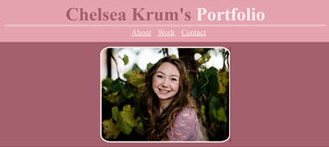
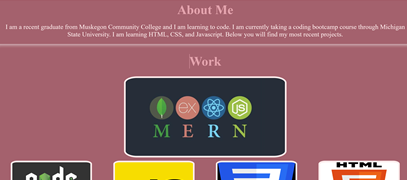
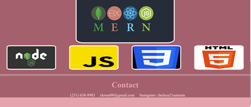

# Professional-Portfolio

## Description
My professional portfolio is a website in which I can showcase my work to employers. In this website, an employer can view a photo of me, a discription of me, my works, and my contact information. When a user clicks on the links below the header, the UI scrolls to the corresponding section in the webpage. When the user clicks on the photos of my projects, it takes the user to that project.

## Installation 
link to website: https://ckrum21.github.io/Professional-Portfolio/ 
link to GitHub: https://github.com/ckrum21 

Install this website by cloning the code to your local devices.

software required to download this website:
* GitBash or other terminal
* Visual Studio Code

## Usage 

The code used for this website is HTML and CSS.
The code for this website displays text, photos, and links to showcase my projects and information to potential employers.

## Credits

Chelsea Krum 
